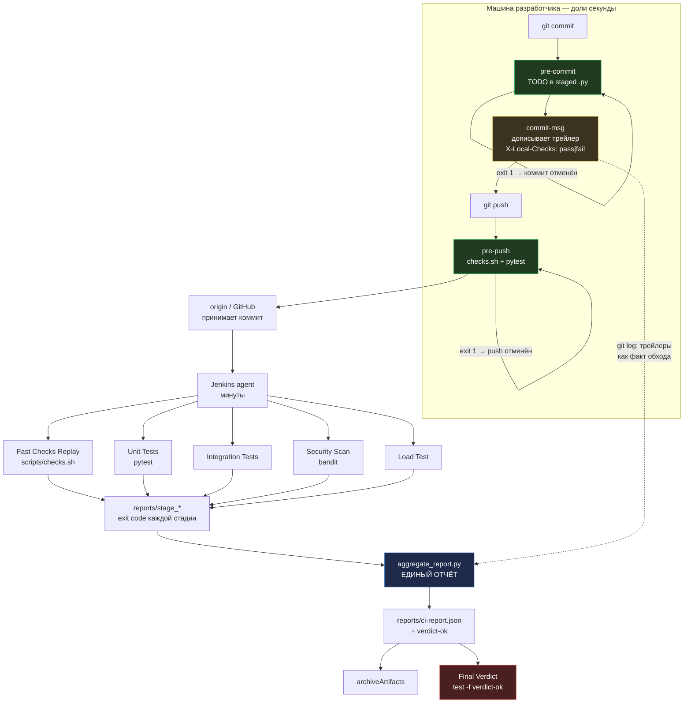

# Архитектура: Git Hooks ↔ Jenkins Pipeline

Документ закрывает требование задания №20: схема взаимодействия, разделение
проверок между локальной машиной и сервером, обоснование выбора и описание
демонстрационного репозитория.

## 1. Цель

Локальные хуки дают разработчику обратную связь за секунды, но их можно
обойти, и они ничего не знают об окружении. Jenkins выполняет полный,
необходимый набор проверок, но отвечает слишком поздно для комфортной
разработки. Архитектура совмещает оба слоя так, чтобы они **дополняли** друг
друга, а не дублировали: локально — дёшево и мгновенно, на сервере — полно и
обязательно.

Ключевой принцип, который проходит через всё решение:

> **Хуки — источник быстрой обратной связи и обходимы. Jenkins — источник
> истины и не обходим.**

## 2. Схема взаимодействия



### Как результаты хуков попадают в отчёт

Хуки не пишут артефактов — у них нет доступа к серверу и они не должны
зависеть от инфраструктуры. Вместо этого `commit-msg` **предметно
аттестует** результат прямо в теле коммита:

```
chore: add TODO guard to pre-commit

X-Local-Checks: fail
```

Дальше `aggregate_report.py` читает эту разметку через
`git log --format=... %(trailers:key=X-Local-Checks,valueonly)` и строит
раздел `local_gates`. Коммиты без трейлера попадают в
`hook_bypassed_commits` — это не ошибка пайплайна, а **видимость факта
обхода**: преподаватель сразу видит, какие коммиты прошли мимо локальных
проверок.

Такой способ выбран, потому что он не требует ни артефактов, ни сетевых
вызовов из хука, и переживает переносимость репозитория: факт «здесь у
разработчика проверки падали» остаётся в истории навсегда.

## 3. Разделение проверок и обоснование

| Проверка | Локально (хуки) | На сервере (Jenkins) | Почему именно так |
|---|---|---|---|
| TODO в staged `.py` | ✅ `pre-commit` | ✅ `ci-check.sh` | Мгновенно: разработчик видит проблему до того, как отправит коммит. Повтор на сервере обязателен, потому что `--no-verify` обходит хук. |
| Синтаксис (`compileall`) | ✅ `checks.sh` | ✅ `checks.sh` | Секунды, ловит опечатки до коммита. Дёшево, дублирование оправдано. |
| Линт (`ruff`) | ✅ `checks.sh` | ✅ Fast Checks Replay | Линтер детерминирован, результат не зависит от машины. |
| Юнит-тесты (`pytest`) | ✅ `pre-push` | ✅ Unit Tests | Единственная проверка, которая на сервере не «дешевле» локальной, но всё равно нужна: локально она спасает разработчика, на сервере — не даёт попасть в main красному коммиту. Если pytest локально недоступен, хук предупреждает и **не блокирует** push. |
| Интеграционные тесты | ❌ | ✅ Integration | Требуют установленных зависимостей и свободного порта. Локально это шум: разработчик не обязан запускать сервер перед каждым `git push`. |
| Сканирование безопасности (`bandit`) | ❌ | ✅ Security Scan | Требует установки отдельного пакета; запуск на каждом коммите неоправданно дорог. Атаки на код статичны — их ловит один прогон на сервере. |
| Нагрузочное тестирование | ❌ | ✅ Load | Измеряет поведение в среде, максимально близкой к боевой. Локальный результат бессмысленен: ноутбук в 20 раз быстрее сервера. |
| Кодировки, права, доступность бинарей | ❌ | ✅ Jenkins Linux | Linux-агент — единственное место, где проявляются платформенные отличия. |

### Почему не всё в хуках

Три причины, по которым тяжёлые проверки нельзя держать локально:

1. **Стоимость.** Нагрузочный тест на 100 запросов занимает десятки секунд.
   Превращать каждый `git push` в такой тормоз — прямой способ добиться,
   чтобы разработчик начал писать `--no-verify` везде.
2. **Среда.** Bandit и нагрузочный тест должны идти на том же Linux, где
   будет крутиться прод. Проверка на Windows даёт ложную уверенность.
3. **Обходимость.** Хук работает на машине разработчика. Даже не прибегая к
   `--no-verify`, его можно отключить одной строкой `core.hooksPath`.
   Единственная проверка, которую нельзя отключить, — та, что выполняется
   на чужом сервере.

### Почему не всё в Jenkins

Если бы все проверки жили только в пайплайне, разработчик узнавал бы об
ошибке в линте через 3–5 минут после push. За это время он уже начал
следующую задачу, и контекст потерян. Именно поэтому `checks.sh`
существует в двух экземплярах: как быстрый локальный гейт и как стадия
`Fast Checks Replay`, которая доказывает, что локальный результат
воспроизводим на сервере.

## 4. Контракт хуков

| Хук | Что делает | Код возврата | Обходим? |
|---|---|---|---|
| `pre-commit` | `git diff --cached` по `.py`, ищет `TODO` в **добавленных** строках | `1` — блокирует | Да, `--no-verify` |
| `commit-msg` | Запускает `checks.sh`, дописывает трейлер `X-Local-Checks` | всегда `0` | Да; блокировки нет намеренно |
| `pre-push` | `checks.sh` + `pytest` | `1` — блокирует | Да, `--no-verify` |

`commit-msg` намеренно **не блокирует** коммит. Его роль — зафиксировать
факт, а не запретить. Синтаксис коммит-сообщения не проверяется: сознательное
расширение объёма работы хука привело бы к тому, что разработчик начнёт
убирать хук, а не чинить сообщение.

### Что значит «проверяется staged, а не рабочее дерево»

`pre-commit` смотрит на `git diff --cached`, а не на файлы в каталоге.
В коммит попадает только индексированное, поэтому проверять рабочее дерево
означало бы блокировать коммит из-за правок, которые в него не попадут.

## 5. Демонстрационный репозиторий

```
Osm/
├── .githooks/              pre-commit, pre-push, commit-msg
├── .github/workflows/ci.yml   GitHub Actions (дублирующий быстрый контур)
├── Jenkinsfile             пайплайн: 5 стадий + агрегация + вердикт
├── ci-check.sh            поиск TODO по отслеживаемым .py (серверная копия)
├── scripts/
│   ├── checks.sh              синтаксис + линт + TODO (локально и на сервере)
│   ├── integration_test.sh    реальный сервер + HTTP-проверки
│   ├── load_test.sh           N запросов, порог среднего времени ответа
│   └── aggregate_report.py    единый отчёт
├── server.py              FastAPI-сервис транскрипции
├── model_loader.py        загрузка модели transformers
└── tests/                 юнит-тесты с моком модели
```

### Установка хуков

```bash
git config core.hooksPath .githooks
```

Настройка локальная, в репозиторий не попадает: у каждого разработчика свои
привычки, и форсировать их общий конфиг — значит ломать чужие рабочие
окружения.

### Локальный запуск

```bash
bash scripts/checks.sh              # быстрые проверки
bash scripts/integration_test.sh    # поднимает сервер на :8101
bash scripts/load_test.sh           # поднимает сервер на :8102
python scripts/aggregate_report.py  # собрать отчёт
```

### Ключевые приёмы, на которых держится работоспособность

- **`.gitattributes` с `eol=lf` для `*.sh` и `.githooks/*`.** При
  `core.autocrlf=true` Git выдаёт скрипты с CRLF, и bash перестаёт их
  понимать: `fi\r` — уже не ключевое слово `fi`, а имя команды. Хуки
  молча перестают работать.
- **`reports/` очищается в начале сборки.** `mkdir -p` не трогает старые
  файлы, и упавшая стадия наследовала бы успешный exit code прошлого
  прогона. Стадия, не оставившая `reports/stage_*`, считается
  проваленной, а не отсутствующей.
- **`echo $? > reports/stage_*` вместо `error()`.** Каждая стадия всегда
  пишет свой код; итог определяет `Final Verdict` по агрегированному отчёту,
  где видны все стадии сразу, а не первая упавшая.
- **`VOICEAPI_SKIP_MODEL_LOAD=1`** в интеграционном и нагрузочном тестах.
  Без него каждая стадия Jenkins тянула бы многогигабайтные веса GigaAM с
  HuggingFace ради пары HTTP-запросов. Тесты проверяют поверхность API, а
  не транскрипцию.
- **Разные порты (`8101` / `8102`)** у интеграционного и нагрузочного
  тестов, чтобы стадии не конфликтовали на одном агенте.
- **Тайминг через `curl -w '%{time_total}'`,** а не `date +%s%N`:
  `%N` есть только у GNU date, на macOS/BSD вывод содержит литерал `N`.
- **Время в `subprocess` задано явно** (`encoding="utf-8"`). Иначе Windows
  декодирует вывод git в cp1251, русские коммиты превращаются в мусор, и
  разбор трейлеров помечает как обойдённые **все** коммиты.

## 6. Ограничения

- Локальные хуки метриками не измеряют. Проверка «сколько времени занимает
  пайплайн» требует истории сборок Jenkins, а не git-трейлеров.
- `git log -10` в отчёте — окно последних десяти коммитов. Для длинной
  истории нужен отдельный периодический отчёт.
- Нагрузочный тест измеряет среднее последовательных запросов к `/health`.
  Это проверка живости сервиса и отсутствия регрессии в обработке, а не
  нагрузочный тест транскрипции: она требует GPU.
- `bandit` ограничен статическим анализом. Уязвимости в зависимостях он не
  ловит — для этого нужен отдельный `pip-audit`/`trivy`.
